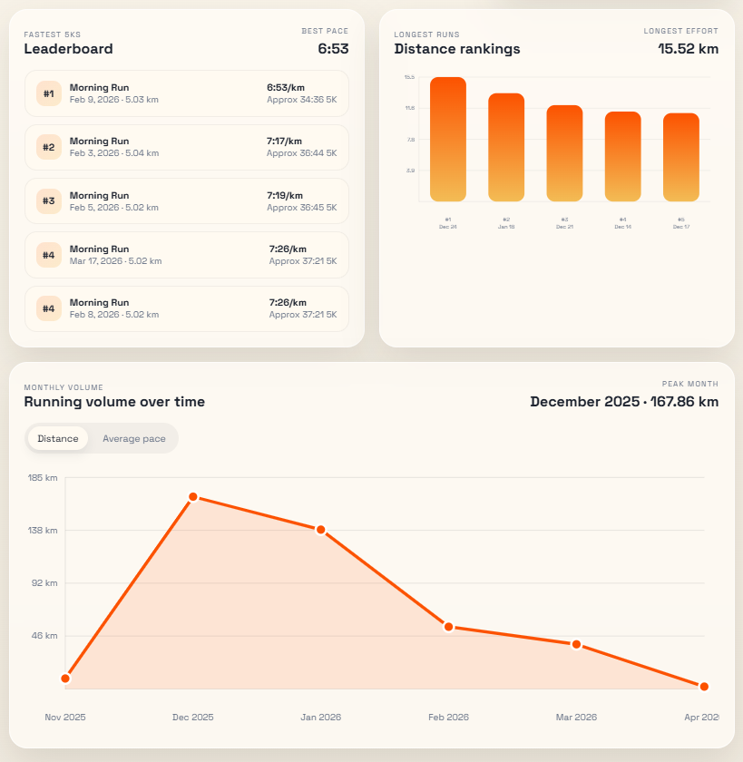

# Strava Running Performance Dashboard
### Location: Phoenix, Arizona

This project turns personal Strava activity data into a Snowflake-backed performance analytics workflow and an interactive dashboard for tracking running progress.

## Project Background
Endurance training generates a steady stream of event-level activity data, but the raw feed from Strava is not immediately useful for performance analysis. This project addresses that gap by building a lightweight ELT pipeline that extracts activity history from the Strava API, stages the raw JSON in Snowflake, and applies SQL-based transformations to produce analysis-ready running metrics.

The focus is on three core performance questions: What are the fastest recorded 5Ks, which runs represent the longest endurance efforts, and how has total running volume changed month over month. The result is a compact analytics system that combines API ingestion, cloud warehousing, SQL modeling, and a presentation layer into a single personal analytics project.

---

## Executive Summary
A review of the current query outputs highlights clear progression and useful performance benchmarks across the running history loaded into Snowflake. The fastest 5K leaderboard shows a top pace of **6:53/km** on **February 9, 2026**, while the longest run ranking peaks at **15.52 km** on **December 24, 2025**.

Monthly training volume shows a concentrated endurance block in winter, with the highest recorded month reaching **167.86 km in December 2025**, followed by **139.08 km in January 2026**. The dashboard makes these trends immediately visible through ranked performance views and interactive time-series exploration, providing a repeatable framework for monitoring pace, distance, and workload over time.

---

## Stakeholders
* **Primary Stakeholder:** Athlete / Project Owner (Focus: performance tracking, training progression, and personal analytics)

---

## Data Architecture and Pipeline
The technical foundation uses a simple cloud analytics pipeline built around raw ingestion and SQL-driven transformation. Activity data is requested from the Strava API, written locally as JSON, uploaded into a Snowflake internal stage, and loaded into a raw table for downstream querying.

* **Extraction:** `scripts/get_tokens.py` retrieves initial OAuth tokens, and `scripts/extract.py` pulls the latest activities from the Strava API.
* **Loading:** `scripts/load.py` uploads `data/raw_activities.json` into the Snowflake stage and copies the payload into `strava_db.raw.activities_raw`.
* **Warehousing:** `queries/setup_database.sql` provisions the database, schema, JSON file format, stage, and raw ingestion table.
* **Analytics Layer:** SQL queries against `strava_db.raw.v_activities_transformed` produce the final metrics used by the dashboard and exported CSV outputs.

---

## Technical Implementation Summary
The implementation uses a compact modern data stack to move from raw activity data to interactive reporting:

* **API Authentication and Data Extraction:** Python scripts use OAuth credentials stored in `.env` to authenticate against Strava and fetch recent athlete activities.
* **Raw Data Persistence:** The extraction step stores API responses in `data/raw_activities.json`, preserving the original nested structure before transformation.
* **Cloud Loading and Storage:** Snowflake stages and loads the JSON payload into a `VARIANT` column, enabling semi-structured ingestion without forcing an immediate schema flattening step.
* **Query Layer:** Three SQL analyses generate the dashboard inputs: fastest 5K rankings, longest-run rankings, and monthly running volume.
* **Visualization:** A lightweight front-end dashboard in `index.html` renders the query results as an interactive leaderboard, bar chart, and time series.

---

## Code References
The project is intentionally small, with each file owning a specific part of the workflow:

* `scripts/get_tokens.py`: Exchanges the Strava authorization code for access and refresh tokens.
* `scripts/extract.py`: Calls the Strava athlete activities endpoint and saves the raw JSON response locally.
* `scripts/load.py`: Uploads the JSON file into Snowflake and copies it into the raw ingestion table.
* `queries/setup_database.sql`: Creates the database objects required for staging and raw storage.
* `queries/ranking_fastest_5ks.sql`: Returns the top five 5K-equivalent runs ranked by pace.
* `queries/ranking_top_runs.sql`: Returns the five longest recorded runs ranked by distance.
* `queries/running_volume_monthly.sql`: Aggregates monthly total distance and average pace.
* `index.html`: Main dashboard entry point.
* `public/dashboard.js`: Loads CSV outputs and renders the interactive charts.
* `public/dashboard.css`: Styles the dashboard layout, cards, charts, and responsive behavior.

---

## Key Insights and Recommendations

### 1. Fastest 5K Benchmark
* **The Insight:** The current best 5K-equivalent pace is **6:53/km**, with the top five performances clustered between **6:53/km** and **7:26/km**.
* **Recommendation:** Use this range as the baseline benchmark for future speed sessions and race-pace tracking. A narrow spread near the top suggests a realistic short-term opportunity to push the full leaderboard below **7:15/km**.

### 2. Endurance Peak Identification
* **The Insight:** The longest recorded run is **15.52 km**, with the top five longest efforts all above **11 km**.
* **Recommendation:** Treat the 11-15.5 km range as the current endurance ceiling and use the ranking view to monitor whether future long runs are extending distance consistently or plateauing.

### 3. Training Volume Concentration
* **The Insight:** Monthly running volume peaks in **December 2025 (167.86 km)** and remains elevated in **January 2026 (139.08 km)** before dropping in later months.
* **Recommendation:** Pair volume tracking with recovery planning. The time-series chart makes it easy to distinguish deliberate base-building blocks from lower-volume maintenance periods.

### 4. Reusable Analytics Workflow
* **The Insight:** The project separates extraction, loading, SQL analysis, and presentation into clear stages, making the workflow easy to refresh as new Strava data arrives.
* **Recommendation:** Extend the current model with new metrics such as cadence trends, elevation gain, weekly consistency, or race-specific pace zones to deepen the training analysis without changing the core pipeline design.

---

## Dashboard Outputs
The interactive dashboard is designed around three core analysis views:

* **Fastest 5Ks Leaderboard:** Surfaces best short-distance performances with pace, date, and rank.
* **Longest Runs Bar Chart:** Compares top endurance efforts in a visual ranking format.
* **Monthly Volume Time Series:** Tracks total distance by month, with an additional toggle for average pace context.

The dashboard code lives in `public/dashboard.js` and `public/dashboard.css`, and reads directly from the CSV outputs stored in `query_results`.

---

## Assumptions and Caveats
* **Data Window:** The extraction script currently pulls the most recent 100 activities, so the analysis reflects the latest accessible subset rather than a guaranteed full historical archive.
* **Transformation Dependency:** The ranking and monthly volume queries assume the presence of `strava_db.raw.v_activities_transformed`, which is referenced by the SQL but not defined in this repository.
* **Dashboard Source Files:** The front-end reads exported CSVs from `query_results`, so the visualizations depend on those result files being refreshed after new query runs.
* **Personal Activity Variance:** All insights are derived from personal workout data and should be interpreted as performance monitoring rather than statistically controlled sports science analysis.
